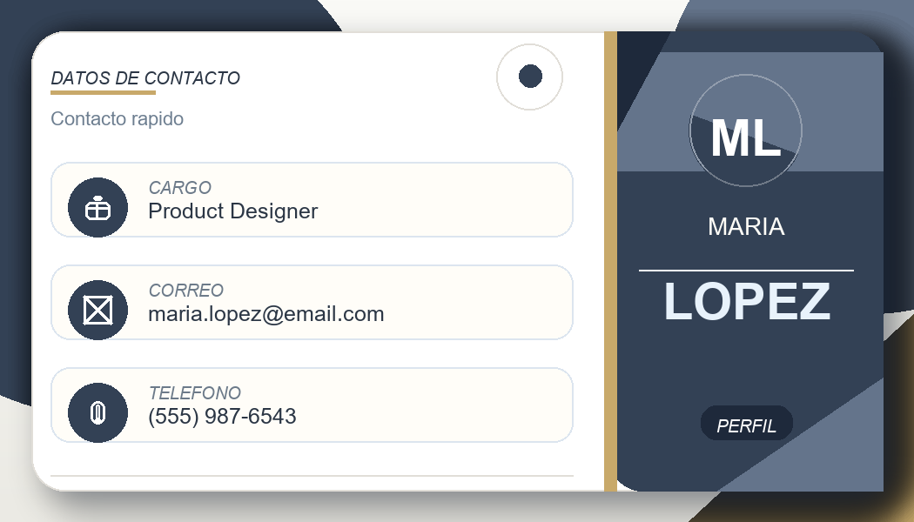

# Business Card Image Generator

[](docs/logo.svg)

[](https://github.com/Boxgui12/business-card-image-generator/actions/workflows/python-ci.yml)

Generador de tarjetas de presentacion en Python con Pillow y Flask.

## Estructura

- `backend/`: logica de generacion de imagen y servidor Flask
- `frontend/`: plantillas HTML y estilos Bootstrap/CSS
- `.venv/`: entorno virtual local

## Requisitos

- Python 3.10+ recomendado
- Dependencias instaladas en el entorno virtual

## Instalacion

```powershell
.\.venv\Scripts\python -m pip install -r requirements.txt
```

## Uso rapido

1. Activa el entorno virtual.
2. Ejecuta el servidor con `.\.venv\Scripts\python app.py`.
3. Abre `http://127.0.0.1:5000`.
4. Completa el formulario, elige la categoria y genera los 10 diseños.
5. Selecciona el diseño final y descarga el PNG.

## Ejecutar el servidor

```powershell
.\.venv\Scripts\python app.py
```

Luego abre:

```text
http://127.0.0.1:5000
```

## Ejecutar la version CLI

```powershell
.\.venv\Scripts\python business_card_generator.py --lang es
```

## Ejemplos visuales

### Vista previa de la tarjeta


### Otro estilo generado



## Notas

- La interfaz permite cambiar entre ingles y espanol.
- Puedes adjuntar una foto para encuadrarla dentro de la tarjeta.
- El flujo web genera 10 diseños aleatorios y luego permite elegir uno antes de crear la tarjeta final.
- Antes de generar la galeria puedes elegir una categoria de estilo y solo se mostraran diseños de esa categoria.
- La galeria incluye filtros por estilo para navegar entre diseños clasicos, modernos y oscuros.
- El selector y el boton principal toman el acento visual de la categoria elegida.
- Las tarjetas generadas se guardan en `backend/generated_cards/`.
